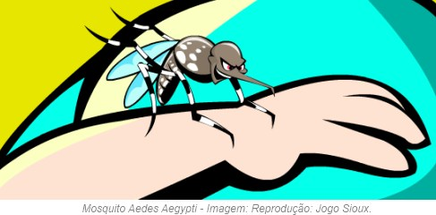
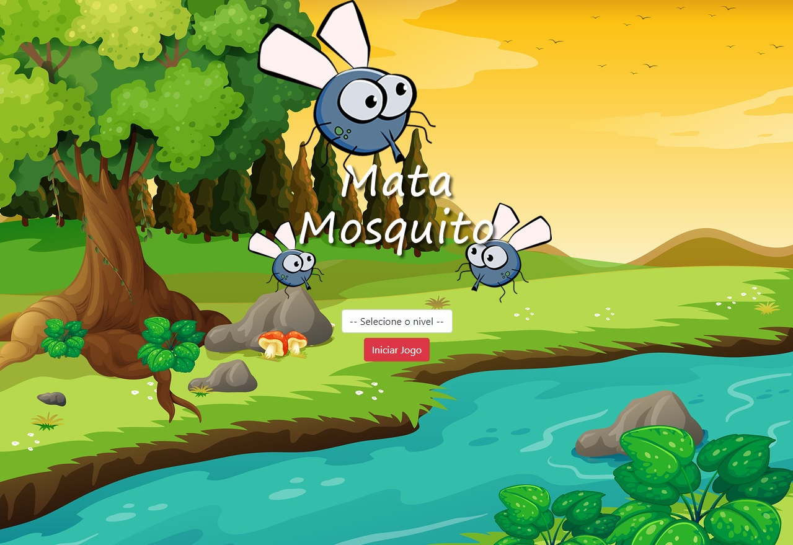

<h1 align="center">
    
</h1>

    <a href="#bookmark-sobre-o-projeto">Sobre</a>&nbsp;&nbsp;&nbsp;|&nbsp;&nbsp;&nbsp;
    <a href="#rocket-tecnologias-utilizadas">Tecnologias</a>

    

## :bookmark: Sobre o Projeto

O **Mata Mosquito** é um projeto feito para ser um jogo infantil, o intuito desta aplicação é melhorar os níveis de conhecimento relacionados a **HTML** , **CSS** e **Javascript**.

Essa aplicação é um projeto de **Wendel Campos Aguiar**.

## :rocket: Tecnologias Utilizadas

-  [Html](https://www.w3schools.com/html/)
-  [CSS](https://www.w3schools.com/html/)
-  [Javascript](https://www.w3schools.com/html/)

